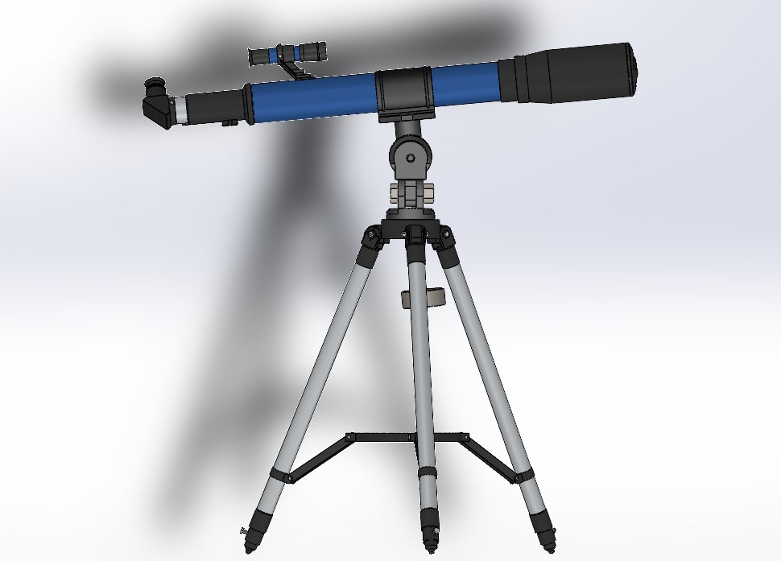

# This project provides a 3D CAD model of a refracting telescope, focusing on the main mechanical components.

## Project Overview
The model includes:
  - Objective Lens Housing
  - Eyepiece Housing
  - Main Tube
  - Mount

The assembly allows for all the movement a real refracting telescope would have.

## Software: Solidworks

## File Structure
 3D files for individual parts and the full assembly cannot be shared under the student license of solidworks.
 
/Videos: Some videos showing the mechanical motion.

/Technical Drawings: some 2D drawings of assemblys and parts.
